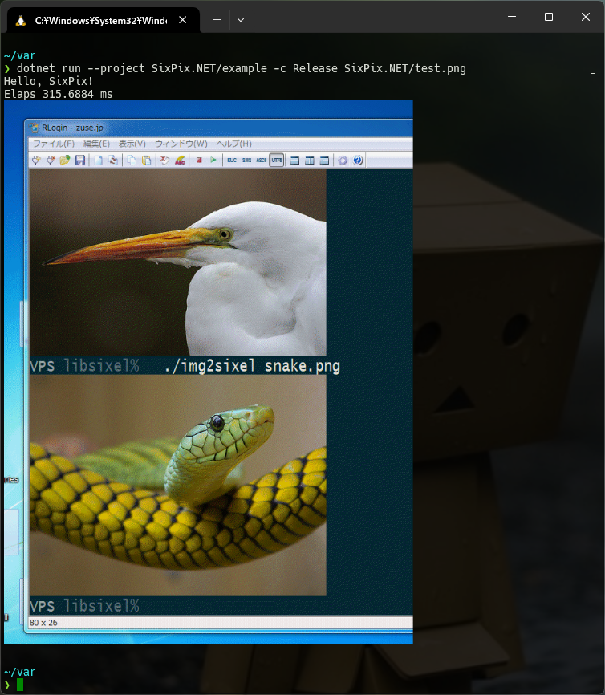

# SixPix.NET
Convert image to Sixel and Sixel to image.

Created with reference to [go-sixel].
And [SixLabors/ImageSharp] is used for image processing.

## :bulb: Example

See: [example directory](./example/)

[go-sixel]: https://github.com/mattn/go-sixel
[SixLabors/ImageSharp]: https://github.com/SixLabors/ImageSharp
